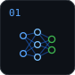
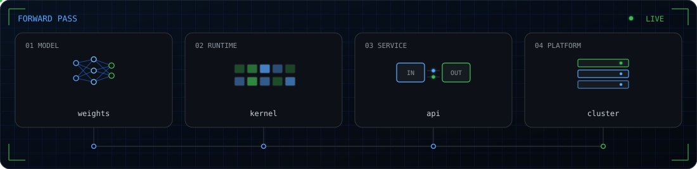

Undergrad building LLM inference, CUDA, and the systems that keep them running.

## Pipeline

A system, in the order it actually runs.




**LLMs and deep learning inference.** PyTorch, from the weights to a running forward pass.

  


**CUDA and parallel programming.** Kernels, warps, and the throughput between them.

  


**Backend concepts and systems design.** APIs with clear boundaries, built for load.

  


  


**Cloud and systems architecture.** Linux, containers, and HPC, from one machine to a cluster.

  


  


## Forward pass



## Activity


## Buffer

```
+----------------------------------------------------------------+
|                                                                |
|            █████╗ ██╗  ██╗███████╗██╗  ██╗██╗████████╗         |
|           ██╔══██╗██║ ██╔╝██╔════╝██║  ██║██║╚══██╔══╝         |
|           ███████║█████╔╝ ███████╗███████║██║   ██║            |
|           ██╔══██║██╔═██╗ ╚════██║██╔══██║██║   ██║            |
|           ██║  ██║██║  ██╗███████║██║  ██║██║   ██║            |
|           ╚═╝  ╚═╝╚═╝  ╚═╝╚══════╝╚═╝  ╚═╝╚═╝   ╚═╝            |
|                                                                |
|     model          runtime         service         platform    |
|       |               |               |               |        |
|   forward()        warp<32>       api / svc        cluster     |
|                                                                |
|    weights in. kernels hot. boundaries clear. machines up.     |
|                                                                |
+----------------------------------------------------------------+

```


## Elsewhere

[LinkedIn](https://www.linkedin.com/in/akshit-vakati-venkata/) · [Kaggle](https://kaggle.com/akshit11318) · [Hugging Face](https://huggingface.co/Akshit11318)